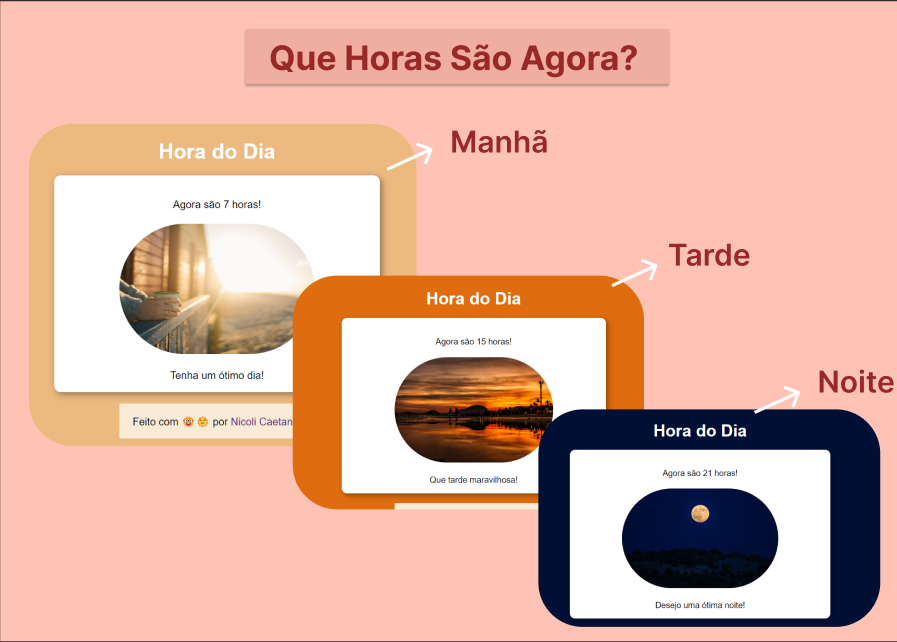

<h1 align="center">Que Horas São Agora?</h1>

  

## 🤔 O que é?

<strong>QHSA - Que Horas São Agora?</strong> é um projeto que interage com o sistema do dispositivo em tempo real. Ele informa ao usuário o horário exato e conforme o período - sendo eles: da manhã, de tarde e de noite - o design se altera.

## 🚀 Tecnologias

Esse projeto foi desenvolvido com as seguintes tecnologias:

- HTML e CSS;
- JavaScript;

Feito com ♥ by Nicoli Caetano.